# STM32-UART-VSCODE-WOKWI-SERIALPLOTTER-SIMULATION
A project demonstrating UART communication between STM32 and PC, simulated via Wokwi with Serial Plotter display.

Step 1: Peripheral Configuration with STM32CubeMX
Initialize the project, configure the system clock, and enable UART1 peripherals using STM32CubeMX. Generate the code using the Makefile toolchain.
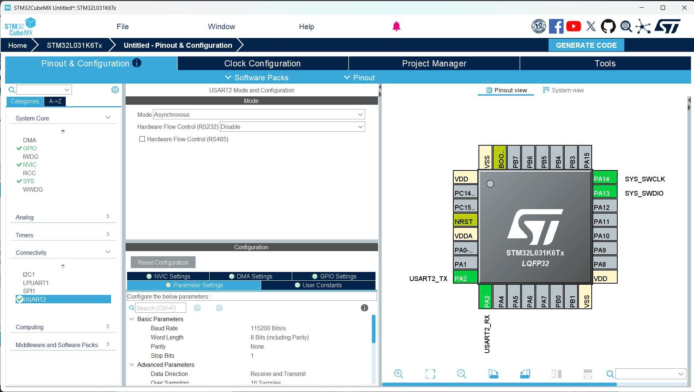
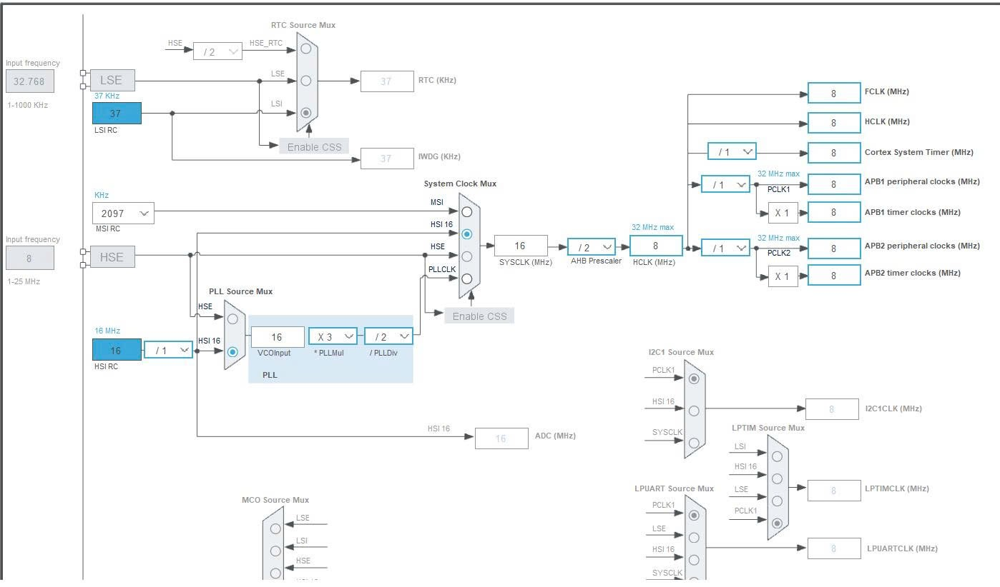
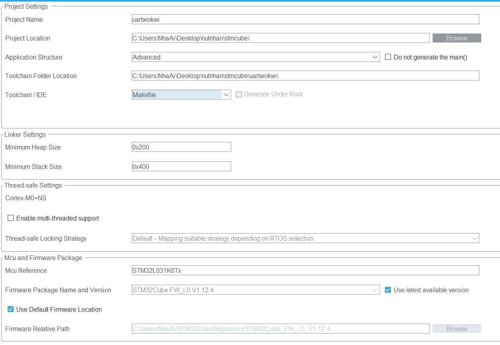
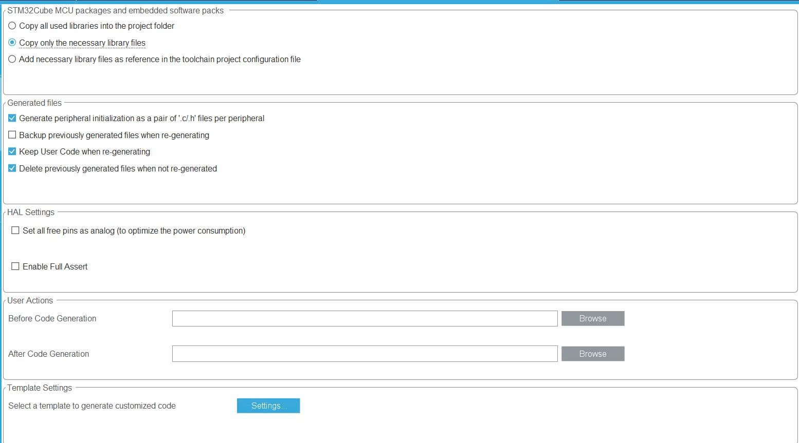
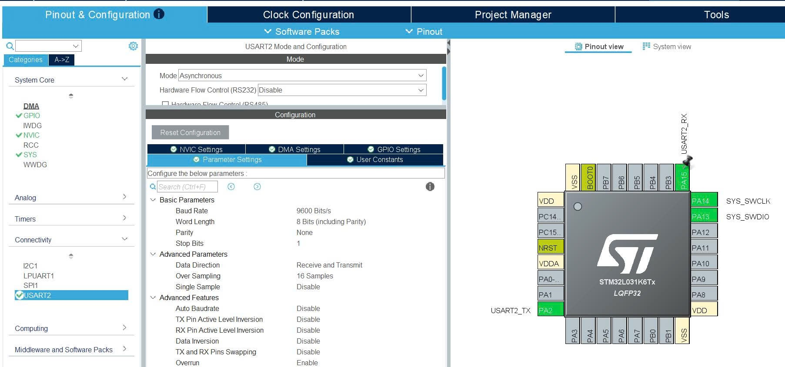

Step 2: Firmware Migration to PlatformIO
Migrate the generated source files by copying the contents of the Inc/ and Src/ folders from the CubeMX project into the include/ and src/ directories of your PlatformIO project.
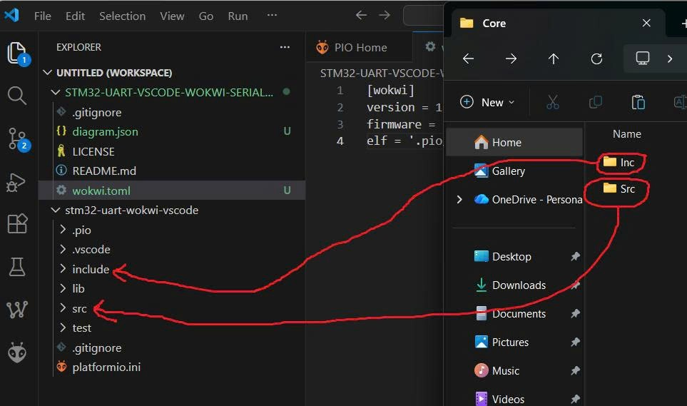
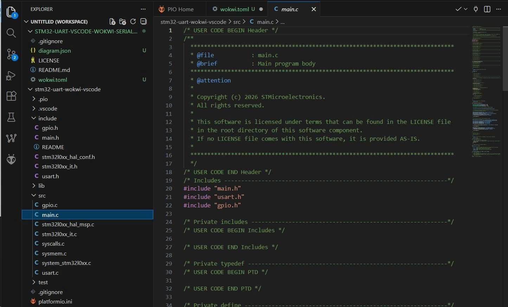
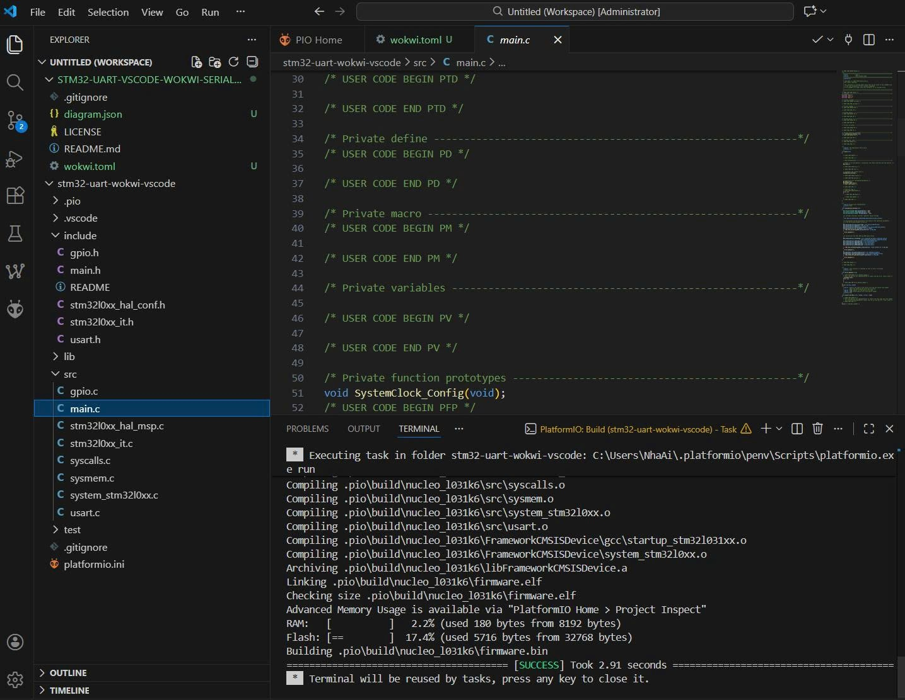
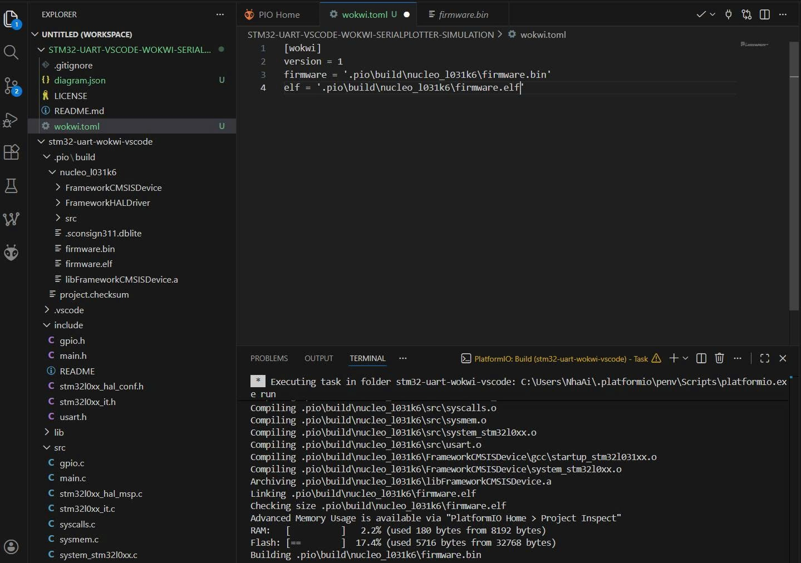

Step 3: Wokwi Simulator License Activation
Set up the Wokwi extension in VS Code and obtain a Wokwi API Key/Token for local simulation support.
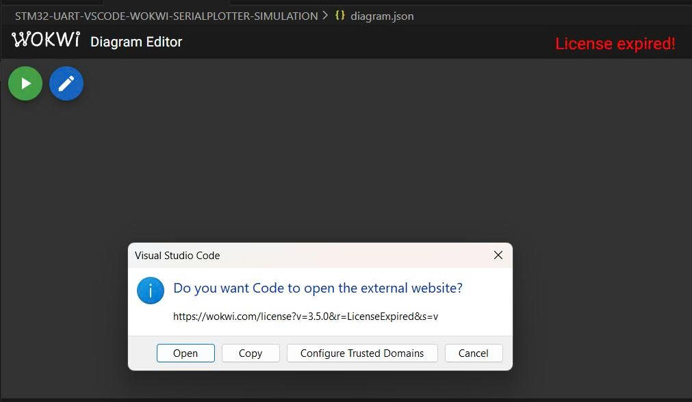

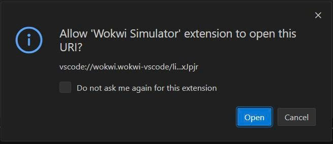
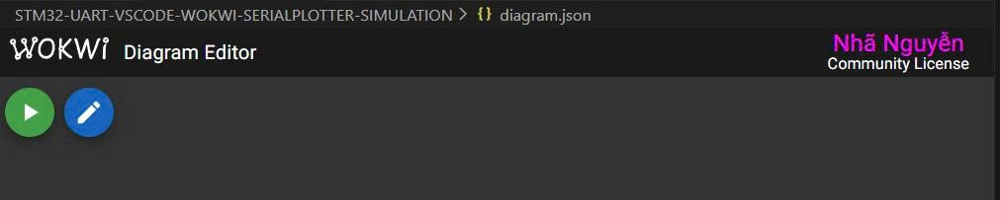
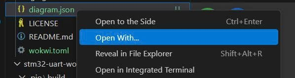

Step 4: Hardware Diagram Synchronization
Synchronize the hardware configuration by copying the JSON definitions from the Wokwi web interface into the local diagram.json file in VS Code.
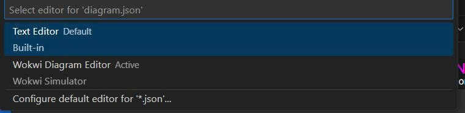
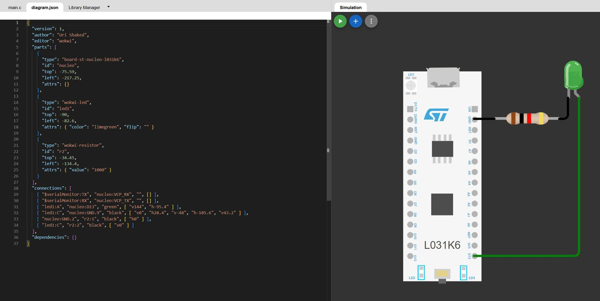
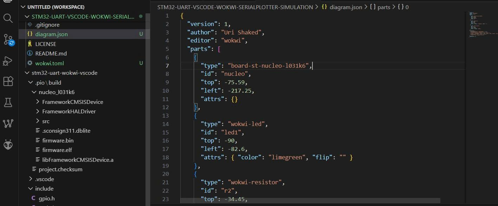
Step 5: STM32L031K6 Hardware Modeling
Design and instantiate the STM32L031K6 (Nucleo-32) board model within the VS Code environment to match the physical pinout and connections.
Step 6: Core Implementation & UART Logic
Implement the essential code blocks for UART data transmission/reception and verify the logic using the integrated Serial Plotter.
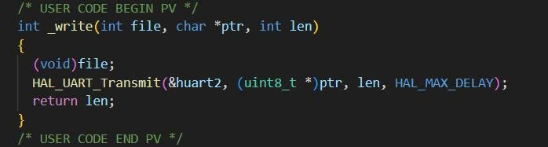
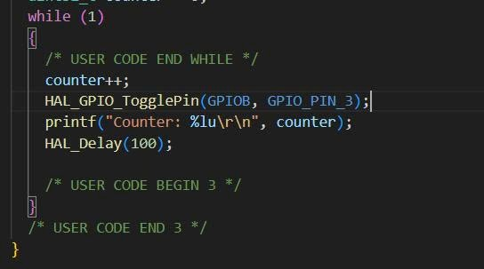